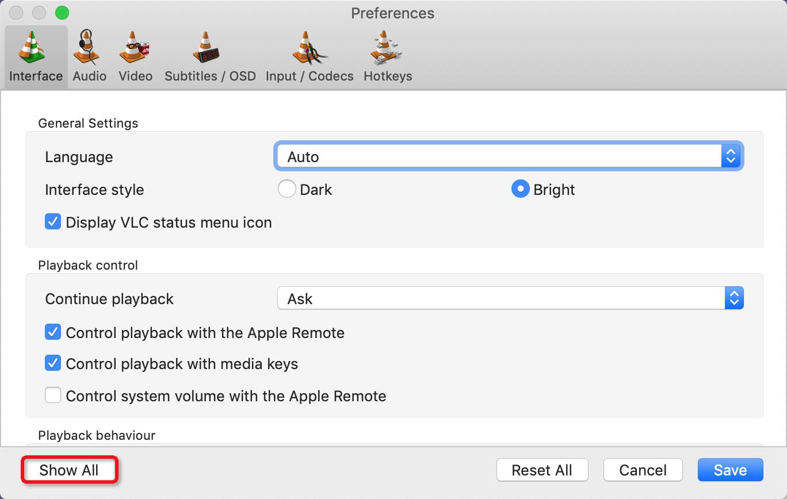
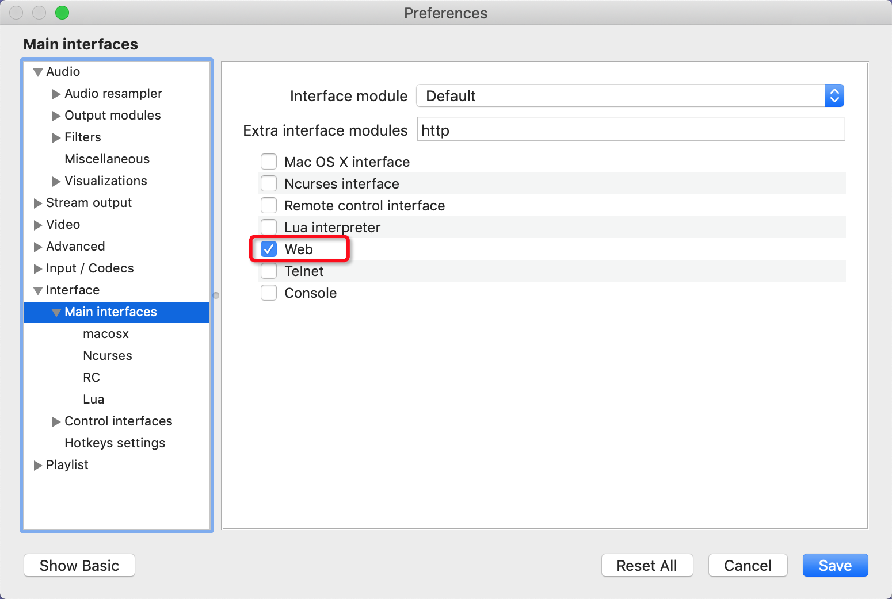
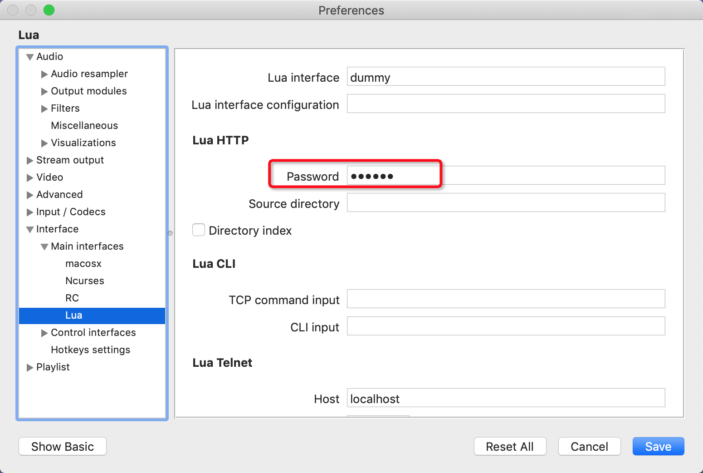

# README

一个VLC的Java客户端，基于VLC的HTTP接口，类型安全，代码可读。

技术栈：

* Spring Boot
* Spring Cloud Feign


## 配置

### 开启VLC的HTTP支持

1. 打开配置，点击Show All
2. 开启Web支持
3. 配置密码

### 配置应用

1. 修改`application.properties` 中的`vlc.http.password.password` 配置属性，与你VLC中配置的密码一致。

2. 修改Feign Client的url，改为你VLC所在地址。

   ```java
   @FeignClient(name = "vlc", url = "http://localhost:8080/requests", configuration = VlcConfiguration.class)
   public interface VlcFeignClient {
       ...
   }
   ```

   如果对代码有洁癖，也可将url属性搞到配置文件里，或者弄个常量。


## 使用示例

```java
vlcFeignClient.playlist();	// 查看播放列表
vlcFeignClient.status(ComplexVlcCommand.IN_PLAY, "file:///文件路径") // 播放指定素材
...
```

一切尽在`vlcFeignClient` 中。


## 测试示例

详见`com.itmuch.vlc.VlcTestController` 中的代码，应有仅有。只需启动，然后用VlcTestController中注释的地址访问即可。


## LICENCE

Apache 2.0

